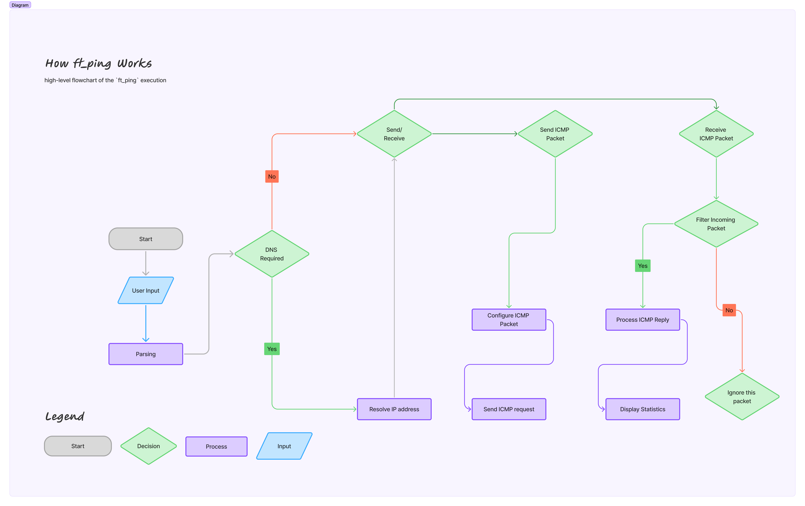

# ft_ping - A Custom Ping Implementation in C

## Table of Contents
- [Introduction](#introduction)
- [Motivation](#motivation)
- [Features](#features)
- [Installation](#installation)
- [Usage](#usage)
- [How It Works](#how-it-works)
- [Diagram](#diagram)
- [Filtering Incoming Packets](#filtering-incoming-packets)
- [Limitations](#limitations)
- [Future Improvements](#future-improvements)
- [References](#references)
- [Conclusion](#conclusion)

---

## Introduction
`ft_ping` is a custom implementation of the well-known `ping` command, built from scratch using C and raw sockets. This program sends ICMP Echo Request packets and measures round-trip times, similar to the standard `ping` utility.

---

## Motivation
This project was born out of curiosity and a deep fascination with low-level networking. Implementing a `ping` command from scratch provided an opportunity to explore raw sockets, ICMP packet structures, and network programming challenges.

Rather than letting the kernel handle everything, this project gave me full control over packet creation, sending, receiving, and timing calculations. Debugging network interactions at this level was both challenging and rewarding. Every bug was a lesson, and every successfully received ICMP packet was a small victory.

Through this journey, I applied and deepened my knowledge of networking protocols, system calls, and performance optimizations.

---

## Features
✅ **ICMP Echo Request/Reply Handling** - Sends ICMP packets and listens for responses.  
✅ **Customizable Options** - Supports options like TTL, interval, timeout, and packet count.  
✅ **Low-Level Socket Programming** - Uses raw sockets to bypass high-level abstractions.  
✅ **Real-Time Statistics** - Displays packet loss, round-trip times (RTT), and other performance metrics.  
✅ **Error Handling** - Detects unreachable hosts, timeouts, and malformed responses.  
✅ **IPv4 Support** - Currently, the implementation is limited to IPv4 ICMP packets.

---

## Installation
### Prerequisites
- A Linux-based system (Raw sockets require root permissions)
- GCC compiler

### Steps
```sh
# Clone the repository
git clone https://github.com/ajemraou/ft_ping.git
cd ft_ping

# Compile the program
make
```

---

## Usage
Run the program with root privileges:
```sh
sudo ./ft_ping <hostname or IP>
```
Example:
```sh
sudo ./ft_ping google.com
```

Available options:
```
-v            : Verbose mode (detailed packet info)
-c <count>    : Number of packets to send
-i <interval> : Interval between packets (in seconds)
-W <timeout>  : Timeout for each reply (in seconds)
-w <timeout>  : Time to wait for a response (in seconds)
--ttl <value> : Time-To-Live for packets
```
Example with options:
```sh
sudo ./ft_ping -c 5 -i 1 -W 2 -w 1 --ttl 64 google.com
```

---

## How It Works
1. **DNS Resolution** - The hostname is resolved to an IP address.
2. **Socket Creation** - A raw socket is created for ICMP communication.
3. **Packet Construction** - An ICMP Echo Request is manually crafted, including headers and payload.
4. **Packet Transmission** - The ICMP packet is sent to the target.
5. **Response Handling** - The program listens for ICMP Echo Replies.
6. **Round-Trip Time Calculation** - The time taken for each packet is measured and displayed.
7. **Statistics Display** - Summary of packet loss, min/max/avg RTT, and other details.

---

## Diagram
Below is a high-level flowchart of the `ft_ping` process:

<p align="center">
    
</p>

---

## Filtering Incoming Packets
Since multiple processes may be sending ICMP Echo Requests, we need to filter the incoming packets to ensure we process only responses related to our `ft_ping` instance.

This is done by checking the ICMP identifier field, ensuring that the received packet matches our process’s sent request:

```c
setsockopt(sockfd, SOL_SOCKET, SO_RCVTIMEO, &timeout, sizeof(timeout));
while (true)
{
    buffer = malloc(PAYLOAD_SIZE + sizeof(struct ip));
    if (!buffer){
        return NULL;
    }
    gettimeofday(&packet->tv_start, NULL);
    packet->bytes_received = recvfrom(sockfd, buffer, PAYLOAD_SIZE + sizeof(struct ip), 0,
                                (struct sockaddr*)&recv_addr, &addr_len);
    packet->ip_header = (struct ip*)buffer;
    packet->ip_header_length = packet->ip_header->ip_hl * 4;
    packet->icmp = (struct icmphdr*)(buffer + packet->ip_header_length);
    if (packet->icmp->type == ICMP_ECHOREPLY && htons(packet->icmp->un.echo.id) == identifier) {
       break;
    }
    else if (packet->icmp->type != ICMP_ECHO)
    {
        orig_ip_header = (struct ip*)(buffer + packet->ip_header_length + sizeof(struct icmphdr));
        orig_ip_header_length = orig_ip_header->ip_hl * 4;
        orig_icmp_header = (struct icmphdr*)((char*)orig_ip_header + orig_ip_header_length);
        if (htons(orig_icmp_header->un.echo.id) == identifier){
            break;
        }
    }
    free(buffer);
}
```

This ensures that we only process ICMP Echo Replies associated with our process.

---

## Limitations
- IPv4 only (no support for IPv6 ICMPv6)
- Requires root privileges to open raw sockets
- No support for advanced features like flooding (`-f`) or adaptive timing (`-A`)

---

## Future Improvements
- Add support for IPv6 ICMP
- Implement a non-root alternative using `SOCK_DGRAM`
- Improve error messages and diagnostics
- Add real-time statistics updates

---

## References
- [GNU Announcement on Raw Sockets](https://lists.gnu.org/archive/html/info-gnu/2021-02/msg00001.html)
- [Internet Control Message Protocol (ICMP) - Wikipedia](https://en.wikipedia.org/wiki/Internet_Control_Message_Protocol)


---

## Conclusion
This project demonstrates how to interact with raw sockets and the ICMP protocol. The key challenge is properly filtering received packets to ensure correctness and avoid interference from other processes.

By implementing `ft_ping`, I gained hands-on experience with networking at the packet level, deepened my understanding of the ICMP protocol, and tackled real-world debugging challenges.

---

## Author
Developed by **ajemraou**, as an exploration of low-level networking and raw socket programming.

